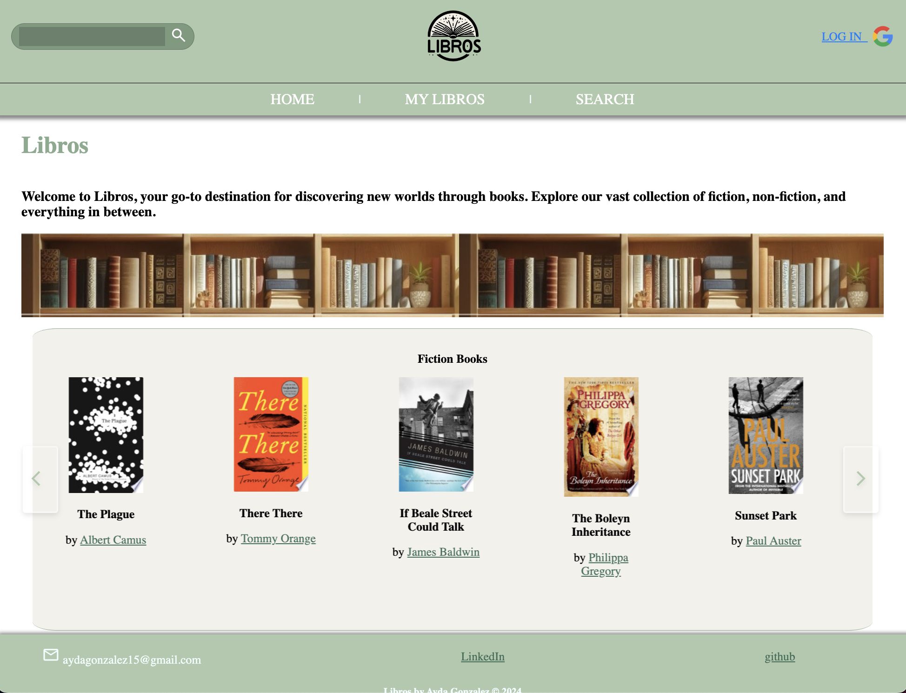
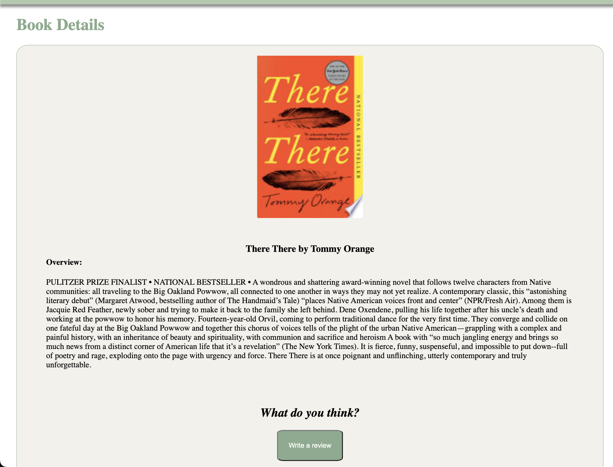
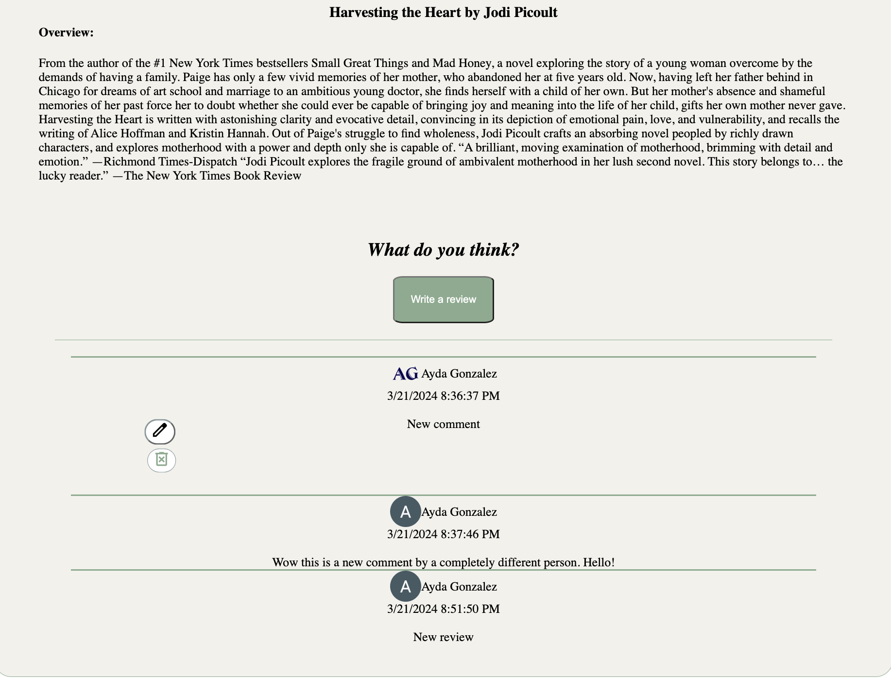

# LIBROS WEB APP

The 'Libros' web application caters to book enthusiasts by offering a diverse array of features. Through an integrated search function utilizing the Google API, users can effortlessly discover books of interest. Moreover, the 'My Libros' feature enables users to curate a personalized collection by saving their favorite titles to a Mongoose database, ensuring seamless access upon subsequent logins.

Delving deeper, users can explore detailed descriptions of books, with the added convenience of accessing more works by a particular author through embedded links. A key highlight of the platform is its interactive review system, allowing users to share their insights on books and subsequently manage their comments through editing or deletion options. While these reviews are visible to other users, ensuring a collaborative environment, editing and deletion privileges are exclusive to the original commenter, preserving the integrity of individual contributions.

Enjoy the Libros App!

# Screenshots

# Technologies Used

- JavaScript
- HTML
- CSS
- MongoDB
- Express
- Node.Js
- Trello
- Heroku
- Git
- Github
- Embedded JavaScript
- Visual Studios Code'
- Google Books API
- Google OAuth

# Getting Started

[Click to visit the Libros Web App!](https://libros-web-app-e2ea9ebfcbfc.herokuapp.com/books)

# Next Steps

- Future enhancement I would like to make is to add another books API that the the user can find a larger array of books 
- Another Future enhancement I would like to make in the future is to add more user benefits like direct links to purchase books directly for the website of have a link to host book clubs

